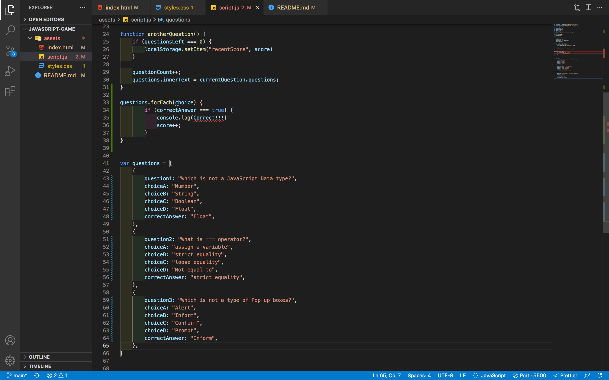

# javascript-game

# Description

### In this JavaScript game, you'll be asked three questions to test your JavaScript knowledge. The quiz consists of fours multiple choices question and gives you the option to save your high score if you want.

# Features

### You'll be able to see what question you're on and out of how many questions. As stated above, you can also save your score and see how it compares to other scores. There is also a one minute timer and if you guess incorrect, time will be subtracted from the overall time.

# Usage

### 

### In the screenshot above, you will be presented with the questions that are listed within the var questions on line 41. The questions will also be asked in the order that they are listed.

# Languages Used

- HTML
- JavaScript
- CSS
